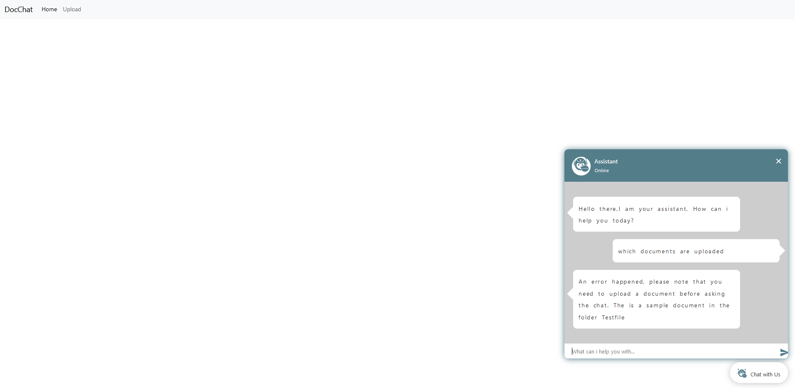
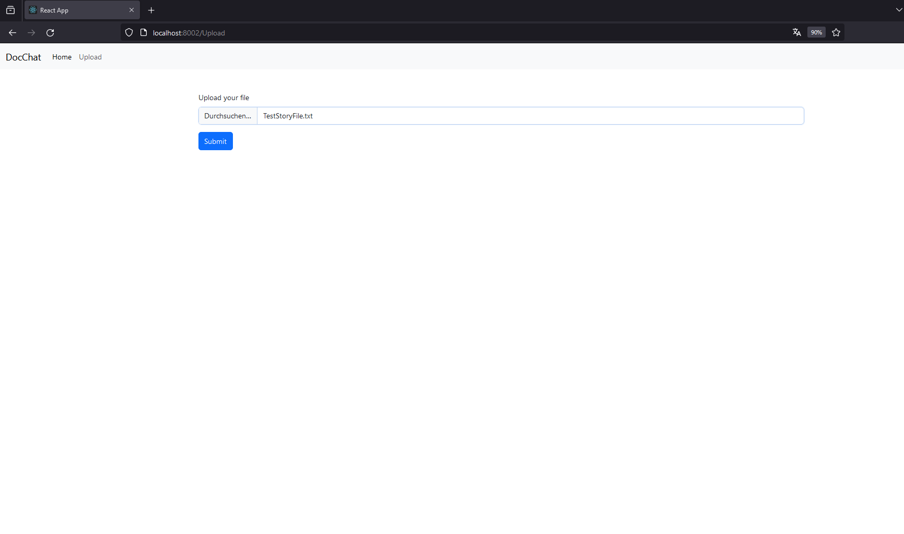

# Python AI Chat App - Documentation

## 1. Used Features

### Frameworks: React, Flask

### Datasource: ChatGPT API

### Architecture: Client-Server via REST API

## 2. Setup

### 2.1 Frontend

- **PowerShell Command:** `cd client`
- **PowerShell Command:** `npx create-react-app .`
- **PowerShell Command:** `npm start`
- **PowerShell Command:** `npm install bootstrap axios react-router-dom`
- **PowerShell Command:** `cd src`
- **PowerShell Command:** `New-Item pages -ItemType Directory`
- **PowerShell Command:** `cd pages`
- **PowerShell Command:** `New-Item Chat.jsx`
- **PowerShell Command:** `New-Item Upload.jsx`
- **PowerShell Command:** `cd ..`
- **PowerShell Command:** `New-Item components -ItemType Directory`
- **PowerShell Command:** `cd components`
- **PowerShell Command:** `New-Item Navbar.jsx`
- **PowerShell Command:** `cd ..`
- **PowerShell Command:** `add "proxy": "http://localhost:5000" to package.json for server connection`

### 2.2 Backend

- **PowerShell Command:** `cd server`
- **PowerShell Command:** `pip install virtualenv`
- **PowerShell Command:** `virtualenv <name>`
- **PowerShell Command:** `powershell -ExecutionPolicy Bypass`
- **PowerShell Command:** `<name>\Scripts\activate`
- **PowerShell Command:** `pip install flask flask-cors`
- **PowerShell Command:** `New-Item Server.py -ItemType File`
- **PowerShell Command:** `python Server.py`
- **PowerShell Command:** `pip freeze > requirements.txt` - Saving the components

## 3. Function of the App

#### When first launched, the API `/delete_all_data` is called to delete all old data in the index (llama-index) and uploads on the server. If the chat is now called, a default message will be returned in the chat due to the error by calling `/ask_ai`, because no documents are available.

 

 

#### A document can now be uploaded by clicking on upload and selecting a document. The repo contains a test file for that purpose.

 

 

#### After the upload, the actor can return to chat and ask which documents are uploaded and what they contain.

 

 